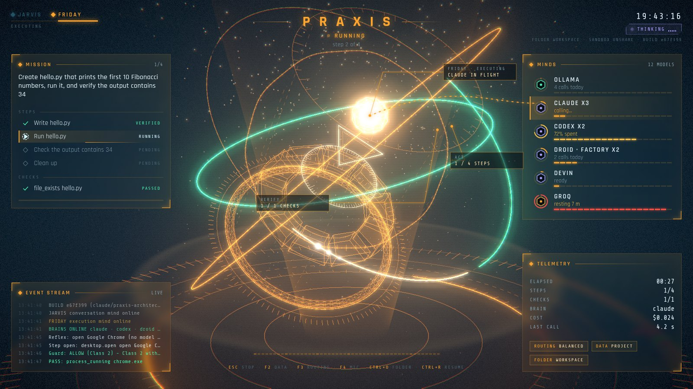

# PRAXIS: first run on your PC

Target: **Windows desktop, Ryzen 7 7700, 32 GB DDR5, RTX 3050** (the app reads your real VRAM, so it works for both the 8 GB and the 6 GB card).
About 20 minutes of setup, then you launch a native desktop window. No browser.

## 1. Get the code

On GitHub, open the repository `ttvmarss/ai-agent`, switch to the branch **`claude/praxis-architecture-rev0`**, then either `git clone` it or use **Code → Download ZIP** and unzip it (for example to `C:\PRAXIS`).

## 2. Python (the only hard requirement)

Install **Python 3.11 or newer** from <https://www.python.org/downloads/> and **tick "Add python.exe to PATH"**. The PRAXIS kernel has **zero** pip dependencies. For the full **command-center window** run one extra command (about 150 MB, installs for your user only):

```
py -3 -m pip install --user PySide6-Essentials
```

Without it PRAXIS still works, in a plainer Tk window that python.org's installer includes. (The installer script below offers this for you.)

Fastest path, from the folder you unzipped:

```
powershell -ExecutionPolicy Bypass -File windows\Install-PRAXIS.ps1
```

It checks everything below, offers to install Python and the window library, creates a **PRAXIS** shortcut on your Desktop, and runs `praxis doctor`. Or just double-click `windows\PRAXIS.bat`.

## 3. Sign in to the tools you have (each is optional; PRAXIS uses whatever it finds)

| Tool | Install (from the vendors' docs) | Sign in |
|---|---|---|
| **Claude** subscription | PowerShell: `irm https://claude.ai/install.ps1 \| iex`  (or `winget install Anthropic.ClaudeCode`) | run `claude`, follow the browser prompt |
| **ChatGPT / Codex** | PowerShell: `powershell -ExecutionPolicy ByPass -c "irm https://chatgpt.com/codex/install.ps1 \| iex"` *(command from third-party guides; the official page is <https://learn.chatgpt.com/docs/cli>, check it)* or `npm install -g @openai/codex` | `codex login` → "Sign in with ChatGPT" |
| **Factory Droid** | follow <https://docs.factory.com/cli/getting-started/quickstart> *(I could not read the exact Windows command from their docs)* | set the `FACTORY_API_KEY` environment variable |
| **Devin** (Devin Desktop, formerly Windsurf) | the `devin` command: in Devin Desktop open the Command Palette and run **Install Devin CLI**, then `devin auth login` ([docs](https://docs.devin.ai/cli)) | nothing else: PRAXIS finds it (even if it is not on PATH), uses it non-interactively with `devin --print` and shows **DEVIN** among its brains. Without the CLI it can use the cloud API instead: set `DEVIN_API_KEY` and `DEVIN_ORG_ID`. Every task handed to Devin asks your approval |
| **Factory** (Droid, Factory Desktop) | the `droid` command (`irm https://app.factory.ai/cli/windows \| iex`), then sign in or set `FACTORY_API_KEY` ([docs](https://docs.factory.ai/droid-exec/overview)) | PRAXIS uses `droid exec` and shows **DROID · FACTORY** among its brains; the Factory Desktop app itself is not needed and is not driven |
| **Ollama** | <https://ollama.com/download/windows> (needs NVIDIA driver **551.61+**) | none; runs in the tray at `localhost:11434` |
| **Docker Desktop** *(optional but recommended)* | <https://www.docker.com/products/docker-desktop/> | lets PRAXIS run code in a **proven** sandbox. Without it, anything that executes code asks your approval each time (safe, just more clicks). Run `docker pull python:3.11-slim` once |

PRAXIS **strips** `ANTHROPIC_API_KEY` / `OPENAI_API_KEY` / `CODEX_API_KEY` from the environment of the Claude and Codex calls, so they use your *subscription login* and can never silently bill an API key.

## 4. Local models for your hardware (do this while the downloads run)

Run `python -m praxis hardware` (or open **Models** in the app). For an RTX 3050 + 32 GB DDR5 the research says:

* Your GPU's 6 to 8 GB VRAM holds only small models. Anything bigger spills into system RAM, and speed then follows RAM bandwidth.
* **Dense 27B models (Qwen 3.6/3.8 27B) would crawl at roughly 2 to 3 tokens/s here.**
* **MoE models with about 3B active parameters are the sweet spot**: they read only ~2 GB per token, so DDR5 carries them at an *estimated* 15 to 22 tokens/s, and 32 GB holds them.

| Role | Model (exact Ollama tag) | Size | Why | Est. speed |
|---|---|---|---|---|
| daily driver | `qwen3.6:35b-a3b-coding` | 23.5 GB | 35B MoE, 3B active, coding tuned | ~19 tok/s |
| agentic alternatives | `laguna-xs-2.1` (20 GB), `north-mini-code-1.0` (19 GB) | | MoE built for agentic coding | ~21 tok/s |
| fast helper | `granite4.2:8b` (5.3 GB; on a 6 GB card use `granite4.2:3b`, 2.2 GB) | | fits fully in VRAM | ~24 tok/s |
| deep thinker | `qwen3.8:27b` / `granite4.2:30b` | 18 GB | dense; slow, for hard background work | ~2 tok/s |

*Sizes and tags were read from each model's Ollama library page on 2026-10-02. **Speeds are physics estimates, not measurements.***

```
ollama pull qwen3.6:35b-a3b-coding      (24 GB download)
ollama pull granite4.2:8b
python -m praxis bench --all-ollama      (measures real quality AND speed; the router then uses the measurements)
```

Recommended Ollama settings for a small-VRAM card (from Ollama's FAQ). Set as Windows user environment variables, then restart Ollama:
`OLLAMA_FLASH_ATTENTION=1`, `OLLAMA_KV_CACHE_TYPE=q8_0`, `OLLAMA_MAX_LOADED_MODELS=1`. Models are stored in `%HOMEPATH%\.ollama`; set `OLLAMA_MODELS` to move them to a bigger drive.

### Your config file (optional)

Copy `praxis.toml.example` to **`%USERPROFILE%\.praxis\praxis.toml`**. This is the only place provider hosts, sandbox, privacy and limits can be set. A `praxis.toml` inside a project folder is deliberately **untrusted** (a downloaded repo could ship one that points your "local" model at someone else's server), so it may only set `[hardware]`, `[role_tiers]` and `[roles]`.

## 4b. Free AIs: keep working when Claude runs out, and use Claude less

PRAXIS can route to free cloud tiers and to local models, so a spent Claude window does not stop you and routine work does not burn it.
**Every free tier needs a free API key** (sign-up is on each vendor's site; then run `python -m praxis keys set groq`, and `python -m praxis free` lists every tier with its limits, data terms and signup link).
Keys are stored only in `%USERPROFILE%\.praxis\secrets.json`, never in the event log, the workspace, or any error message.

| Tier | Free limit (read 2026-10-02) | What it does with your prompts | Class |
|---|---|---|---|
| **Groq** | ~30 requests/min, ~1,000/day, 8K tokens/min (so PRAXIS keeps prompts small) | documented: no training on API data | trusted |
| **Cerebras** | 5 requests/min, 1M tokens/day | documented: prompts and outputs not retained (no training policy stated) | trusted |
| **Ollama Cloud** | starter credits, 1 request at a time; limits unpublished | "we do not use them to train models" | trusted |
| **Google Gemini API** | free tier, ~15 requests/min (varies by model) | **may be used to improve Google products; humans may read it** | open |
| **Mistral (Experiment)** | ~1B tokens/month | **free-tier conversations are training data unless you opt out** | open |
| **NVIDIA NIM (trial)** | ~40 requests/min *(community figure)* | trial use only: do not submit confidential data | open |
| **OpenRouter `:free` models** | 20 requests/min, 50/day *(community figure)* | **free providers may log prompts for training** | open |

`python -m praxis free` prints the same table with a source link for every number. **Limits change; a 429 from the provider always overrides these figures.**
Paths I checked and **did not build on because they no longer exist**: Gemini CLI's free Google-login tier (ended 2026-06-18), Qwen Code's free OAuth (ended 2026-04-15), GitHub Models' free API (retired 2026-07-30).

**Two keys control all of this (the footer under the core always shows the current setting):**

* **F2: DATA** says what a goal may touch. **PRIVATE** = local models only, nothing leaves the PC. **PROJECT** (default) = local + trusted cloud (Claude, ChatGPT, Groq, Cerebras...). **OPEN** = also the free tiers that may train on prompts. Even at OPEN, a prompt that contains something shaped like a password, API key or private key is never sent to an open tier.
* **F3: FRUGALITY** says how to spend. **QUALITY** = best model regardless of cost. **BALANCED** = best first, and once benchmarked the cheapest that is as good. **FRUGAL** = local model first, then free tiers, then Claude from small to large; if a cheaper model's work **fails verification**, PRAXIS restores the workspace and retries with the next stronger one (max 2 escalations). This is how Claude gets used less.

When a provider says "limit reached", it rests until the time the provider states (Retry-After or the reset text), and the next one in the ladder takes over. `python -m praxis free` and the config's `[budgets]` section show and set each model's allowance; the core shows each AI's spent share as an arc.

## 5. First launch



Open PRAXIS (the **PRAXIS** shortcut, or type `praxis` in a terminal). It opens in its own window (Edge or Chrome in app mode; nothing to install). You see the hologram first: PRAXIS's heart is an **arc reactor in exploded view**, floating over a holo table, inside three tilted rings. Nothing on it is invented.

* **Two minds, one core.** **JARVIS** (cool ice-blue) is in charge while PRAXIS idles, listens and talks; **FRIDAY** (amber) takes over while a goal runs. The two names top-left show which is lit; the hand-over glides.
* **The three rings are the kernel's real pipeline.** One arc per real step (ACT) and per real check (VERIFY), coloured by its state: grey = waiting its turn, bright with a comet = running, amber = needs you, green = verified, red = failed. When the goal verifies, the VERIFY ring seals shut and a shockwave runs out across the table.
* **MISSION (left)** is the goal with its real steps and checks. **MINDS (right)** is your AIs: free and local ones green, subscriptions violet; the meter is how much of the allowance is spent, a ring means it is resting after a limit, and a stream of sparks runs from the core to the one being called right now. **EVENT STREAM** and **TELEMETRY** (elapsed, steps, checks, brain, cost, last call) fill the corners. On a narrow window the panels fold away and only the hologram remains.
* **Authorisation.** When PRAXIS needs your say-so, an **AUTHORISATION REQUIRED** card shows the exact action. Deny has the focus; Esc denies; Approve unlocks after a moment so nothing is approved unread. You can also answer by voice (say the wake word, then approve or deny).
* **The ring of bars around the core is the real audio**: yours while it listens, its own while it speaks. Every real event flares the core and sends a ripple across the table. Click the core and it answers.
* **Keys:** Esc stop · F2 data class · F3 routing · F4 mic · Ctrl+O folder · Ctrl+R resume. If voice cannot start, a typing line appears so the app is never unusable.
* **You can restyle it.** The look is data: `ui/src/theme.json` (colours, fonts, effect strengths, how each state moves the machine). Put your changes in `~/.praxis/theme.json`. To change the design itself, work in `ui/` (see `ui/README.md`: `npm run dev` gives a live-reload preview with a scripted engine).

1. Add a free key or two (Groq and Cerebras are trusted tiers): `python -m praxis keys set groq`. Download the recommended local models: `python -m praxis hardware`, then `python -m praxis pull <tag>`.
2. Run **`python -m praxis bench --max-cost 3`**. This sends test tasks to every available model and writes measured quality, speed and cost to the registry. After that the router picks **the cheapest model that is as good as the best**. Heads-up: this uses real subscription usage; the `--max-cost` cap stops new providers once the estimate passes it.
3. Try a safe first goal on a scratch folder (**Ctrl+O** → make a new empty folder):
   * *"Create hello.txt containing exactly: Hello, Stark"*
   * *"Write a Python function slugify(text) in slug.py with a unit test, and run the tests."*
   * *"Read notes.txt and write a one-sentence summary to summary.txt."*

## 5b. Talk to it

If you installed the voice packages, the first launch downloads the speech models (about 200 MB, once; the screen says so) and then
PRAXIS greets you. **Just talk, no name needed** (set `wake_required = true` in `[voice]` if you want it to act only after you say "Praxis"): *"Make a file called notes.txt with today's tasks."* It repeats
what it understood, works, and tells you the result. Other things to say: *"Praxis, status"*, *"stop"*, *"mute"* (F4 listens again),
*"frugal"* / *"balanced"* / *"quality"*, *"private"* / *"project"* / *"open"*. When it asks for approval it reads the action out loud:
say **"Praxis, approve"** (risky actions need that exact word; "Praxis, yes" is enough only for mild ones; your name is always required to approve, so a TV can't) or **"deny"**; silence denies. If it mishears you, the words it heard are shown
on screen. No microphone or model? It tells you why and gives you a one-line typing field. Headphones help if your speakers are loud.

**Check it works:** `py -3 -m praxis voice` tests your speaker, voice, microphone and how fast a model replies, and says which link is the
problem. **Talk naturally:** questions and small talk get answers ("Praxis, how are you?", "what time is it?", "explain what a mutex is");
asking it to *do* something ("create", "fix", "run"...) starts a task, which it plans, does and checks. For quick replies add a free Groq
key (`py -3 -m praxis keys set groq`) or install Ollama: replies through the Claude/Codex/Droid tools take several seconds each.

## 6. How to use it safely

* **STOP (Esc, or Ctrl+.)** is always live. It kills in-flight model calls, stops before the next step, and **restores the workspace** to how it was before the goal.
* **Approval dialogs show the exact action** and default to **Deny**. Anything that sends your files to a cloud agent, spends money, or runs code without a proven sandbox asks you first. Closing the dialog or pressing Esc is a refusal.
* **A plan built from file contents can never exceed reversible actions**, even if you click "approve": this is what stops a malicious line inside a document from driving the machine.
* **What VERIFIED means:** the goal passed the checks listed under *Evidence*, and the Guard allowed every step. It does **not** prove the checks match what you meant. If a goal is ambiguous the model may write checks that encode a misreading (in a live test, "exactly: Hello, Stark. Then create..." produced `Hello, Stark.` with the period). Read the Evidence for important work, state exact values, and keep the *Second-opinion critic* on when you have two vendors installed.
* **`python -m praxis why <event>`** shows the causal chain for any action; **`python -m praxis verify-log`** proves the history was not edited.
* **Resume**: if the app or PC dies mid-goal, the next launch says so on the core; **Ctrl+R** resumes it.
* Everything is stored in `<your folder>\.praxis\` (event log, checkpoints, registry). PRAXIS refuses to read or write that folder, `.git`, or `praxis.toml` on a plan's behalf.

## 7. What is verified, and what is not

**Verified in the build environment (Linux):** 448 automated tests, all green (the full suite on Python 3.11 with PySide6; the Tk window tests on 3.12 under a virtual display; 56 of them drive the real command-center window and widget offscreen, including the real approval dialogs and the rings carrying real results); dozens of deliberate sabotage checks on the security-critical code were caught (every test gap they exposed was fixed and re-checked); real **Claude** subscription runs through PRAXIS: 30/30 capability tasks (18 tuned + 12 held-out), 12 trap runs with 0 attacks, 0 false "done" claims (one earlier held-out run, 1 of 15, failed once for an unrecorded reason and did not reproduce in 4 reruns); the desktop window was launched, driven and screenshotted under a virtual display.

**NOT verified, because it could not be run where this was built. Expect to find bugs here, and please tell me what breaks:**

* The window **on Windows itself** (layout/DPI/fonts; I verified it offscreen on Linux and reviewed screenshots), the `.bat` and `.ps1` launchers (no PowerShell available), and Docker as the Windows sandbox.
* **The free tiers live.** I had no keys, so each adapter is tested against local fake servers that return the real error shapes (429 with Retry-After, 402, 404 model-gone, 401, 413, daily-quota text). That proves PRAXIS's behavior, not each vendor's. The limit figures are from vendor docs and community lists read on 2026-10-02; `praxis free` shows the source of each.
* **Codex, Droid, Devin and Ollama live.** They are tested against their *documented* interfaces with recording fake programs and local servers, which proves how PRAXIS calls them but not how the vendors behave today. `python -m praxis doctor --ping` and `bench` are how you find out. Droid's JSON output format is not documented in detail (the parser is defensive).
* The **speed numbers** for your GPU are estimates until you run `bench --all-ollama`.

## 8. If something goes wrong

| Symptom | Do this |
|---|---|
| Window will not open | `python -m praxis.desktop` in a terminal shows the error. Plain-looking window? `py -3 -m pip install --user PySide6-Essentials` for the full one. `--tk` forces the plain one |
| A free tier is missing | it has no key yet: `python -m praxis keys set <name>` (`python -m praxis free` lists them) |
| The core is hollow on a model | the data class (F2) forbids it for this goal (e.g. PRIVATE blocks every cloud model) |
| Claude is always used first | press F3 until the footer says FRUGAL, and add free keys / pull a local model so there is something cheaper to try first |
| A provider shows `SKIPPED` | `python -m praxis doctor` prints the reason (not installed / not logged in / Ollama not running) |
| Everything asks for approval | No proven sandbox: install Docker Desktop and run `docker pull python:3.11-slim`, then System → *Re-run sandbox self-attack* |
| Local model is slow | System/Models show measured tok/s; lower `num_ctx` in your user `praxis.toml`, set the Ollama variables above, or pick the 8B helper |
| Wrong GPU numbers | set `[hardware] vram_gb / ram_gb / ram_bw_gbps` in `%USERPROFILE%\.praxis\praxis.toml` (see `praxis.toml.example`) |
| Stuck on STOPPING | it is waiting for a model call to die; if a CLI ignores the kill, close the window (it will ask) |
